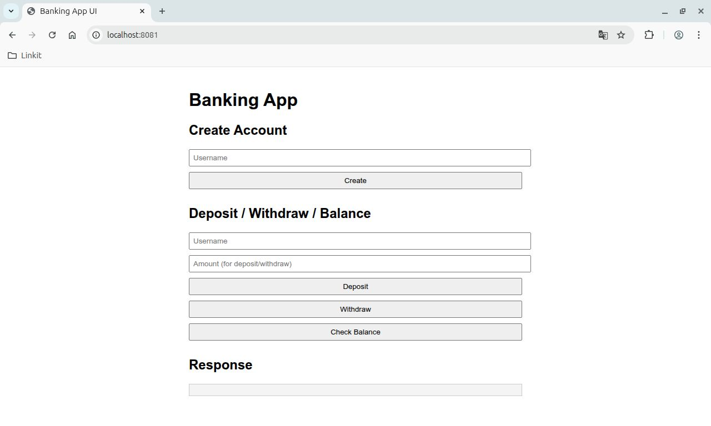

# Banking App (Erlang)

🚧 **Work in Progress**

This project is a simple, stateful banking application built in Erlang using the `gen_server` behavior for managing account state, and `Cowboy` as the HTTP server. It supports basic operations like account creation, deposit, withdrawal, balance checking, and listing users through HTTP endpoints.

## TODO
- [x] Support for account deletion or renaming
- [ ] A web UI for interacting with the banking API

## Features

- Create user accounts with unique IDs
- Support multiple named accounts per user
- Deposit and withdraw money
- Check account balances
- HTTP API interface using Cowboy
- Modular OTP-style architecture

## Roadmap

- [x] Core banking logic
- [x] Basic HTTP endpoints
- [ ] Web UI frontend

## Directory Structure
```bash
banking_app/
├── apps/
│ ├── bank_core/ # Core banking logic (gen_server and account processes)
│ └── bank_web/ # Web interface (HTTP routes via Cowboy)
│ └── banking_app/
├── rebar.config
└── README.md
```

---

## Getting Started

### Prerequisites

- Erlang/OTP 25+
- [rebar3](https://rebar3.org) (Erlang build tool)

Visit the HTTP API (after starting):

http://localhost:8080/accounts

### Clone and Compile

```bash
git clone <your-repo-url>
cd banking_app
rebar3 compile
```
### Run the App
```bash
rebar3 shell
```
## HTTP API
1. Create Account
```bash
curl -X POST http://localhost:8081/create/testuser
```
2. Deposit
```bash
curl -X POST http://localhost:8081/deposit/testuser -d "100"
```
3. Withdraw
```bash
curl -X POST http://localhost:8081/withdraw/testuser -d "30"
```
4. Get Balance
```bash
curl http://localhost:8081/balance/testuser
```
5. List All Users
```bash
curl http://localhost:8081/users
```
## Example Output
```bash
{
  "user": "testuser",
  "balance": 70
}
```
## Design Notes
- Each user account is managed as a separate Erlang process.
- The `bank_server` is a `gen_server` that keeps track of all user processes in a map.
- Communication with user accounts is done via message passing and synchronous replies.
- The web layer (in `bank_web`) uses Cowboy to expose HTTP endpoints.

## Screenshots
